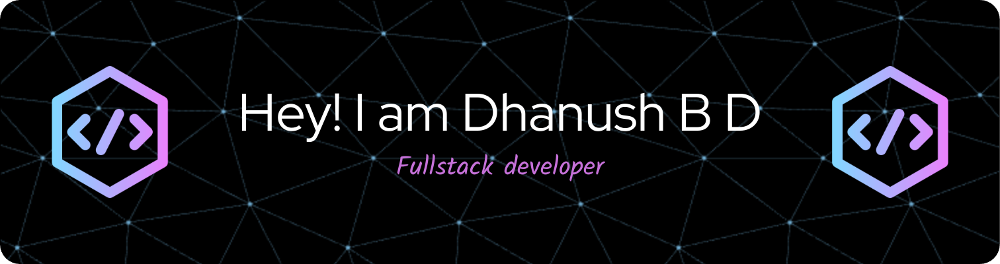

# 💫 About Me:
🎓 Currently pursuing **B.Tech in Computer Science Engineering** at Srinivas University, Mukka (CGPA: **8.95**).  🖥️ Experienced in both **frontend and backend** development, with a strong focus on delivering quality solutions.  🛠️ Skilled in modern technologies such as React, Node.js, TailwindCSS, PostgreSQL, and more.  🌍 ***Multilingual***: Proficient in English, Kannada, Hindi, and Tulu.  ***💼 Experience:***  **Full Stack Developer at Kakunje Software Pvt. Ltd.:** Worked on live projects, honing skills in responsive web design and database management.  **Content Writer at Srinivas University:** Increased website traffic by 20% through targeted SEO strategies.  🚀 ***Projects:***  **Electronickart:** An eCommerce platform with secure authentication, product management, and an admin panel.  **Mind Mingle:** A blog platform leveraging React and Appwrite for seamless content creation.  **Real-Time Chess Game:** A multiplayer chess application using React and Socket.IO.  **Knowledge Sync - EdTech Platform :** Knowledge Sync is a frontend-focused EdTech platform designed to enhance learning experiences. Built with React, TailwindCSS.  ***📚 Certifications:***   Information Technology Specialist in JavaScript (Certiport - Pearson VUE)  

## 🌐 Socials:
     

# 💻 Tech Stack:
                              
# 📊 GitHub Stats:
 
 

## 🏆 GitHub Trophies

### 🔝 Top Contributed Repo

---

<!-- Proudly created with GPRM ( https://gprm.itsvg.in ) -->
