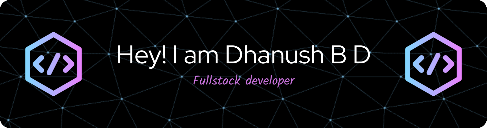

# 💫 About Me:
💻 Full Stack Developer passionate about building scalable applications and exploring cutting-edge technologies.

🚀 Currently working as a **Software Developer at Technical Career Education (Jan 2025 – Present)**  
→ Building modern **EdTech and AI-powered platforms**  
→ Working on **AI workflows, automation systems, and intelligent applications**  
→ Developing scalable full-stack solutions for learning platforms  

🧠 Highly interested in:
- Artificial Intelligence & LLM Applications
- AI Automation & Agentic Workflows
- Full Stack Development
- Modern Web Technologies
- Real-time Systems
- Backend Architecture & APIs
- Robotics + Software Integration

🛠️ Skilled in:
- Frontend: React, TailwindCSS, Redux, Vite
- Backend: Node.js, Express, Django, Go
- Databases: PostgreSQL, MongoDB, MySQL
- AI/Tools: LangChain, Generative AI APIs, Qdrant
- Dev Tools: Git, Docker, Appwrite, Vercel, Render

🌍 Multilingual: English, Kannada, Hindi, Tulu

---

# 💼 Experience:

### 💻 Software Developer — Technical Career Education *(Jan 2025 – Present)*
- Building AI-driven and EdTech platforms
- Developing scalable full-stack applications
- Working on AI integrations and automation workflows
- Creating responsive and performance-focused systems

### 💻 Full Stack Developer — Kakunje Software Pvt. Ltd.
- Worked on production-level web applications
- Developed backend APIs and responsive interfaces
- Improved database performance and application reliability

### ✍️ Content Writer — Srinivas University
- Increased website traffic through SEO optimization
- Created educational and technical content

---

# 🚀 Projects:

### 🤖 AI Documentation Chatbot
- Built a RAG-based chatbot using LangChain, FastAPI, Qdrant, and Generative AI
- Supports documentation querying for programming languages and frameworks

### 🛒 Electronickart
- Full-featured eCommerce platform
- Authentication, admin dashboard, product management

### 🧠 Mind Mingle
- Blog platform using React and Appwrite
- Smooth content creation and management system

### ♟️ Real-Time Chess Game
- Multiplayer chess application using React and Socket.IO
- Real-time synchronization and gameplay

### 📚 Knowledge Sync — EdTech Platform
- Frontend-focused learning platform
- Built with React and TailwindCSS
- Designed to improve digital learning experiences

---

# 📚 Certifications:
🏅 Information Technology Specialist in JavaScript  
*(Certiport - Pearson VUE)*

---

# 🌐 Socials:

---

# 💻 Tech Stack:

---

# 📊 GitHub Stats:

---

# 🏆 GitHub Trophies

---

### 🔝 Top Contributed Repo

---

